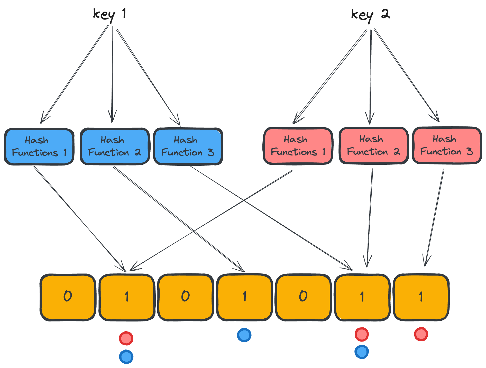

# Bloom Filter
This is a Bloom Filter implementation in Go, a probabilistic data structure used for membership testing. Bloom Filters are memory-efficient data structures that provide fast membership queries. They can efficiently determine whether an element is "probably in set" or "definitely not in set".



## Usage
Here's how you can create and use a Bloom Filter instance:
```

import (
    "fmt"
    "github.com/yourusername/bloom_filter"
)

func main() {
    // Create a new Bloom Filter
    bf := bloom_filter.NewBloomFilter(1000, 0.01)
    
    // Add keys to the Bloom Filter
    bf.Put("1")
    bf.Put("2")
    bf.Put("3")
    
    // Check if an key exists in the Bloom Filter
    exists := bf.Lookup("1")
    fmt.Println("Exists:", exists) // Output: Exists: true
    
    // Check if a non-existent key exists in the Bloom Filter
    nonExistent := bf.Get("4")
    fmt.Println("Non-existent:", nonExistent) // Output: Non-existent: false
}

```

### Bloom Filter Parameters
Bloom filter has 4 parameters:

- Number of elements (n)
- False positive rate (p)
- Number of bits (m)
- Number of hash functions (k)

We need only 2 parameters, the **number of elements (n**) and **false positive rate (p)** and the rest of parameters can be calculated by the following formulas:

```math
m = -\frac{n\ln(p)}{(\ln(2))^2}
```

```math
k = \frac{m}{n}\ln(2)
```

## Running Tests
You can run the unit tests for the Bloom Filter using the following command:

```sh
go test ./...
```
This command will execute all tests within the project directory and its subdirectories.

